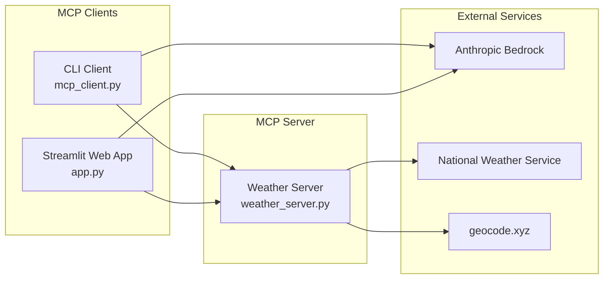

# Weather MCP Example – Project Overview

This repository demonstrates a **complete** Model-Context-Protocol (MCP) setup comprising:

1. **An MCP server** exposing three weather-related *tools* (`get_alerts`, `get_forecast`, `get_lat_long`).
2. **Two MCP clients**: a CLI chatbot and a modern Streamlit web application that dynamically discover tools and call them through Anthropic's function-calling interface.

Everything is wired through the **stdio transport**, so no network sockets are required – the clients spawn the server as a subprocess and exchange JSON-RPC messages over STDIN/STDOUT.

---
## 1. Directory structure

```text
python/weather/
│
├── client/                # MCP clients
│   ├── .env               # Model + token limits
│   ├── app.py             # Streamlit web application (MCP client)
│   ├── mcp_client.py      # CLI chatbot (MCP client)
│   ├── __init__.py
│   └── server_config.json # Configuration for MCP servers
│
├── server/                # MCP server implementation
│   ├── __init__.py
│   ├── weather_server.py  # FastMCP server + tool definitions
│   └── weather_server.log # Server logs
│
├── pyproject.toml         # uv-style metadata + dependencies
├── uv.lock                # Locked dependencies
├── README.md              # High-level project read-me
└── OVERVIEW.md            # ← **this file**
```

---
## 2. MCP *tool* lifecycle

| Phase | Server (FastMCP) | Client | Notes |
|-------|------------------|--------|-------|
| **Registration** | Decorate an `async def` with `@mcp.tool` → FastMCP introspects the signature & docstring. | After `session.initialize()` the client calls `session.list_tools()` to fetch metadata. | Tool input schema is auto-derived from the type-hints. |
| **Invocation** | FastMCP waits for a `tool.invoke` JSON-RPC request. | Anthropic replies with a `tool_use` block; the client maps `tool.name` to the correct session and calls `session.call_tool(...)`. | Both requests / responses are *async*; httpx is used under the hood for I/O. |
| **Result** | Returns `str` (or any serialisable JSON) to the client. | The client forwards the result back to Anthropic via a `tool_result` message so the model can continue chatting. | |

---
## 3. Server internals (`server/weather_server.py`)

```mermaid
flowchart TD
    subgraph "MCP Weather Server"
        A[FastMCP\("Weather"\)] --> B[get_alerts]
        A --> C[get_forecast]
        A --> D[get_lat_long]
    end
    
    subgraph "External APIs"
        E[National Weather Service]
        F[geocode.xyz]
    end
    
    B --> E
    C --> E
    D --> F
```

### 3.1 Constants
* `NWS_API_BASE` – base URL for the US National Weather Service API. All requests are built on top of this path.
* `GEOCODE_API_BASE` – base URL for geocoding service to convert city names to coordinates.
* `USER_AGENT` – proper User-Agent header for API requests.

### 3.2 `get_alerts(state: str) -> str`
* Builds the URL `/alerts/active/area/{state}`.
* Makes HTTP call to National Weather Service API with proper error handling.
* Each GeoJSON *feature* is formatted and concatenated into human-readable alerts.

### 3.3 `get_lat_long(place: str) -> str`
* Converts US city names to latitude/longitude coordinates.
* Uses geocode.xyz API with timeout and error handling.
* Returns formatted coordinates that can be used with `get_forecast`.

### 3.4 `get_forecast(latitude: float, longitude: float) -> str`
* First hits `/points/{lat},{lon}` to resolve the *forecast* URL.
* Second request fetches the 7-day / 12-hour period forecast.
* Only the **next 5 periods** are returned to keep responses concise.

### 3.5 Tool Chaining

The AI automatically chains tools for complex requests:
```
User: "What's the forecast for San Francisco?"
1. get_lat_long("San Francisco") → 37.7749, -122.4194
2. get_forecast(37.7749, -122.4194) → Detailed forecast
```

### 3.6 Bootstrapping

```python
if __name__ == "__main__":
    mcp.run(transport="stdio")  # blocks forever
```

Running with `transport="stdio"` makes the file perfectly suited for spawning by another process (our client). No additional CLI wrapper is required.

---
## 4. Client Architecture

The project includes two MCP clients that demonstrate different interaction patterns:



---
## 5. CLI Client internals (`client/mcp_client.py`)

### 5.1 `MCPChatBot.__init__`
* Creates an `AsyncExitStack` to manage all async contexts.
* Configures **AnthropicBedrock** (AWS region `us-west-2`).
* Pre-allocates: `available_tools`, `sessions` (tool→ClientSession).

### 5.2 Server discovery
* `connect_to_servers()` opens `server_config.json`. Each entry is a *StdioServerParameters* dict with the **command** to launch.
* For each server:
  1. `stdio_client()` spawns the process.
  2. A `ClientSession` is initialised.
  3. `list_tools()` response is cached so subsequent queries need no extra RTT.

### 5.3 Chat loop
* Reads user input → `Anthropic.messages.create()` with the aggregated `tools` list.
* Handles streamed `content` blocks. When a `tool_use` block appears it **synchronously calls** the remote tool and sends the `tool_result`.
* Continues until the assistant no longer issues tool calls.

### 5.4 Environment & limits
`.env` provides two vars consumed on import time:
* `MODEL` – e.g. `anthropic.claude-3-sonnet-20240229-v1:0`.
* `MAX_TOKENS` – max output tokens per Anthropic call.

---
## 6. Streamlit Web Client (`client/app.py`)

The Streamlit application provides a modern web interface for the weather MCP system:

### 6.1 Architecture
* **StreamlitMCPClient**: Manages async MCP connections within Streamlit's synchronous environment
* **Event Loop Management**: Uses separate event loops for initialization and query processing
* **AsyncExitStack**: Proper async context management for MCP connections
* **Session State**: Maintains conversation history and client state

### 6.2 Key Features
* **Chat Interface**: Modern chat UI with message history
* **Tool Visibility**: Sidebar showing connected MCP servers and available tools
* **Error Handling**: Comprehensive error handling with user-friendly messages
* **Real-time Processing**: Live updates during tool execution

### 6.3 Usage Examples
* "What are the weather alerts in California?"
* "Show me the forecast for San Francisco"
* "Get me latitude and longitude for New York City"

---
## 7. How to run locally

```bash
# 1️⃣  Install UV and create virtual environment
pip install uv
uv venv
# Activate virtual environment
source .venv/bin/activate  # On macOS/Linux
# .venv\Scripts\activate     # On Windows

# 2️⃣  Install dependencies
uv sync

# 3️⃣  Configure AWS credentials for Anthropic Bedrock
aws configure  # or set environment variables

# 4️⃣  Update server path in client/server_config.json
# Edit the path to match your installation directory

# 5️⃣  Choose your client:

# Option A: Streamlit Web App (Recommended)
cd client
uv run streamlit run app.py
# Open browser to http://localhost:8501

# Option B: CLI Chatbot
cd client
uv run mcp_client.py

# Option C: Test server directly
cd server
uv run weather_server.py
```

**Environment Configuration**: The project includes a `.env` file in `client/.env` with default settings. You can modify the model or token limits if needed.

---
## 8. Extending the example

1. **Add a new tool**
   * Define `async def your_tool(...)` in `weather_server.py`.
   * Decorate with `@mcp.tool()` (FastMCP auto-generates schema from type hints).
2. **Both clients pick it up automatically** on next run – no code change required.
3. **Add more MCP servers** by adding entries to `client/server_config.json`.
4. For non-stdio transport (WebSocket, HTTP/2, etc.) replace `mcp.run(transport="stdio")` accordingly and update `server_config.json`.

---
## 9. Key takeaways

* **Tools are first-class citizens**: the only API surface exposed by the server.
* **Type-hints ⇨ JSON schema**: FastMCP auto-generates the `input_schema` sent to LLMs.
* **Multiple client patterns**: CLI for development, Streamlit for user-friendly interfaces.
* **Tool chaining**: AI automatically chains tools (geocoding → forecast) for complex requests.
* **Async all the way down** ensures the server remains responsive even with slow upstream APIs.
* The architecture is **LLM-agnostic** – swap Anthropic for OpenAI, Gemini, etc. by replacing the `anthropic` block.
* **Production-ready**: Comprehensive error handling, logging, and async context management.
